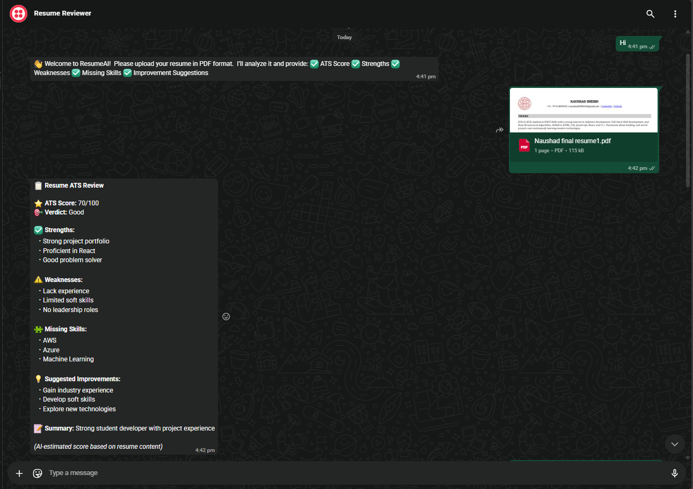
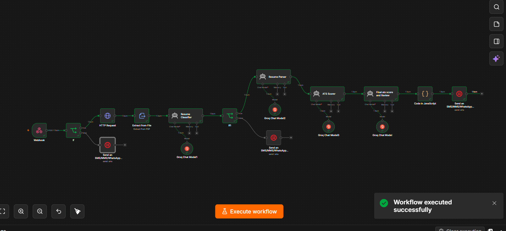
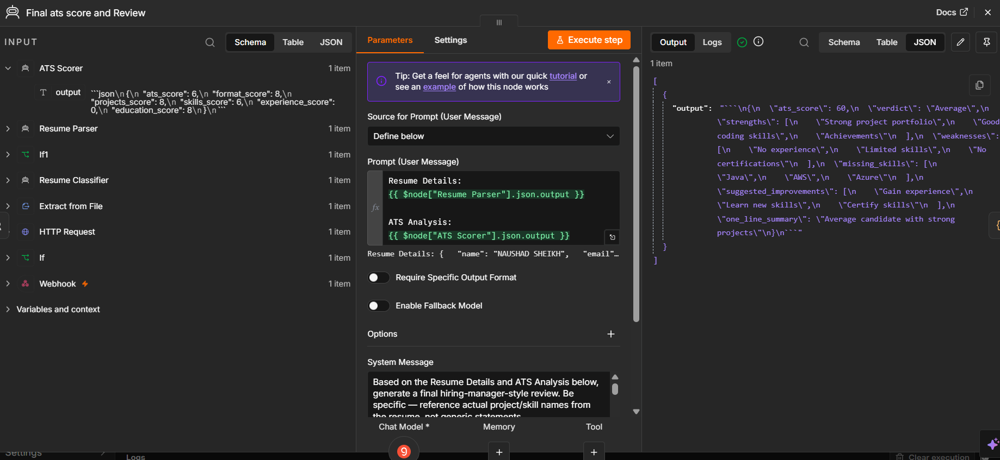
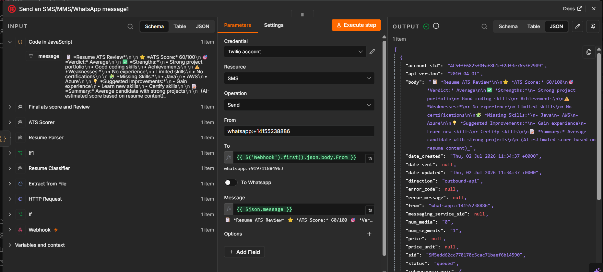

# 🤖 AI WhatsApp Resume Reviewer

An AI-powered WhatsApp chatbot that automatically reviews resumes and provides personalized feedback using **n8n**, **Groq AI**, and the **WhatsApp Cloud API**.

---

##  Features

-  Upload resumes directly through WhatsApp
-  AI-powered resume analysis
-  ATS-focused resume feedback
-  Highlights strengths and weaknesses
-  Suggests actionable improvements
-  End-to-end automation using n8n workflows
-  Instant replies on WhatsApp

---

## 🛠️ Tech Stack

- n8n
- Groq AI
- WhatsApp Cloud API
- REST APIs
- Webhooks

---

##  Project Workflow

```text
User Uploads Resume (PDF)
        │
        ▼
WhatsApp Cloud API
        │
        ▼
n8n Workflow
        │
        ▼
Extract Resume Text
        │
        ▼
Groq AI Analysis
        │
        ▼
Generate Personalized Feedback
        │
        ▼
Reply on WhatsApp
```

---

## 📸 Screenshots

### WhatsApp Chat



### n8n Workflow



### AI Resume Review



### ATS Feedback



## 🚀 Getting Started

### Connect to the WhatsApp Sandbox

Before using the chatbot, connect your WhatsApp account to the Twilio Sandbox:

1. Save the Twilio Sandbox number:
   **+1 415 523 8886**
2. Open WhatsApp.
3. Send the following message:

```text
join managed-run
```

4. Wait for the confirmation message from Twilio.
5. Once connected, send your resume as a **PDF** to the same WhatsApp number.
6. The chatbot will analyze your resume and reply with AI-generated feedback within a few seconds.

> **Note:** The sandbox join code may change. Check your Twilio Console for the latest code before testing.
##  Future Improvements

- Job Description (JD) matching
- Resume scoring
- Multi-language support
- Cover letter generation
- Interview preparation suggestions

---

##  Author

**Naushad Sheikh**

If you found this project helpful, consider giving it a ⭐.
