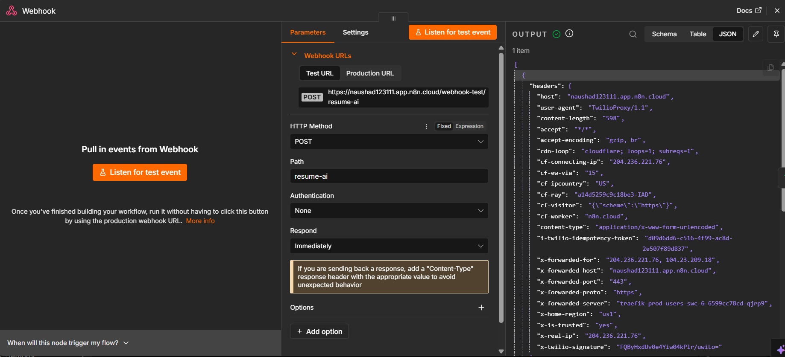
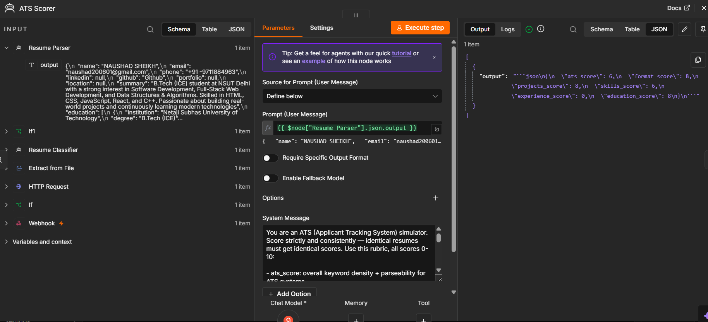

# 🤖 AI WhatsApp Resume Reviewer

An AI-powered WhatsApp chatbot that automatically reviews resumes and provides personalized feedback using **n8n**, **Groq AI**, and the **WhatsApp Cloud API**.

---

## ✨ Features

- 📄 Upload resumes directly through WhatsApp
- 🤖 AI-powered resume analysis
- 📊 ATS-focused resume feedback
- 💪 Highlights strengths and weaknesses
- 🎯 Suggests actionable improvements
- ⚡ End-to-end automation using n8n workflows
- 💬 Instant replies on WhatsApp

---

## 🛠️ Tech Stack

- n8n
- Groq AI
- WhatsApp Cloud API
- REST APIs
- Webhooks

---

## 📂 Project Workflow

```text
User Uploads Resume (PDF)
        │
        ▼
WhatsApp Cloud API
        │
        ▼
n8n Workflow
        │
        ▼
Extract Resume Text
        │
        ▼
Groq AI Analysis
        │
        ▼
Generate Personalized Feedback
        │
        ▼
Reply on WhatsApp
```

---

## 📸 Screenshots

### WhatsApp Chat


### n8n Workflow


### AI Resume Review



### ATS Feedback



##  Getting Started

1. Clone the repository

```bash
git clone https://github.com/Naushad527/REPO_NAME.git
```

2. Import the workflow into n8n.

3. Configure your Groq API credentials.

4. Configure your WhatsApp Cloud API credentials.

5. Activate the workflow.

---

## 📌 Future Improvements

- Job Description (JD) matching
- Resume scoring
- Multi-language support
- Cover letter generation
- Interview preparation suggestions

---

## 👨‍💻 Author

**Naushad Sheikh**

If you found this project helpful, consider giving it a ⭐.
